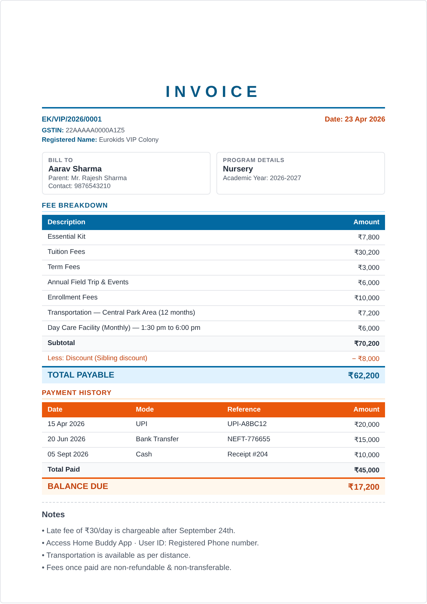

# Eurokids — Invoice Generator

A student-centric invoice generator backed by **Google Sheets**. Search for an enrolled student by name, parent name, contact, or invoice number — then either load any past invoice to amend, or view a full payment history across all their invoices. No duplicate records, no manual tracking. Works fully offline with local cache when the sheet is unreachable.



---

## Table of Contents

1. [How It Works](#how-it-works)
2. [Part 1 — Set Up the Google Sheet Backend](#part-1--set-up-the-google-sheet-backend)
3. [Part 2 — Deploy the App to GitHub Pages](#part-2--deploy-the-app-to-github-pages)
4. [Part 3 — Connect the App to Your Sheet](#part-3--connect-the-app-to-your-sheet)
5. [Day-to-Day Usage](#day-to-day-usage)
6. [Student Search & Payment History](#student-search--payment-history)
7. [Sheet Structure](#sheet-structure)
8. [Updating Fee / Transport / Program Data](#updating-fee--transport--program-data)
9. [Printing on Letterhead](#printing-on-letterhead)
10. [Troubleshooting](#troubleshooting)

---

## How It Works

```
    Browser (laptop/phone)                    Google Sheet
  ┌─────────────────────┐                 ┌───────────────────┐
  │  index.html         │                 │  Invoices_2026-27 │
  │  (on GitHub Pages)  │ ←─ HTTPS ────→  │  Payments_2026-27 │
  │                     │   Apps Script   │  Invoices_2027-28 │
  │  Offline cache      │   Web App       │  …                │
  └─────────────────────┘                 └───────────────────┘
```

- The HTML app is hosted free on **GitHub Pages**
- A **Google Apps Script** attached to your sheet acts as the backend
- Every save/load goes through the Apps Script URL over HTTPS
- On page load, the app pulls the current academic year's invoices into an in-memory list
- **Student search** runs against that in-memory list — instant, no extra network calls
- When the sheet is unreachable, the app falls back to a browser cache; the sync bar at the top shows live status

---

## Part 1 — Set Up the Google Sheet Backend

You do this once. Takes about 5 minutes.

### Step 1.1 — Create a Google Sheet

1. Go to [sheets.google.com](https://sheets.google.com) and click **Blank** (+ icon)
2. Name it something like **Eurokids VIP Invoices**
3. Leave the default empty `Sheet1` — the Apps Script will create the proper sheets automatically on first use

### Step 1.2 — Open Apps Script

1. In your sheet, click **Extensions → Apps Script** (this opens a new tab)
2. You'll see a code editor with a file called `Code.gs` containing a default `myFunction()`
3. **Select all** the default code and **delete it**

### Step 1.3 — Paste the Backend Code

1. Open the `Code.gs` file that came with this project
2. Copy all of its contents
3. Paste into the Apps Script editor (replacing the empty `Code.gs`)
4. Click the **💾 Save** icon (or press Ctrl+S / Cmd+S)
5. When prompted to name the project, call it **Eurokids Invoice Backend**

### Step 1.4 — Deploy as Web App

1. Click **Deploy → New deployment** (top right)
2. Click the gear ⚙ icon next to "Select type" → choose **Web app**
3. Fill in the fields:
   - **Description**: `Eurokids Invoice API v1` (any text is fine)
   - **Execute as**: **Me** (your Google account)
   - **Who has access**: **Anyone**
     > ⚠ Important: must be "Anyone" — the frontend calls it without authentication. The URL itself is the only "password", so treat it as secret-ish.
4. Click **Deploy**

### Step 1.5 — Authorize Access

Google will ask you to grant permissions:

1. Click **Authorize access**
2. Pick your Google account
3. You'll see a "Google hasn't verified this app" warning — this is normal because it's **your own** script
4. Click **Advanced → Go to Eurokids Invoice Backend (unsafe)**
5. Click **Allow** on the permissions screen

### Step 1.6 — Copy the Web App URL

After deployment, you'll see a green success screen with a **Web app URL** like:

```
https://script.google.com/macros/s/AKfycbx.......................I2oOz/exec
```

**Copy this URL and keep it safe.** You'll need it in Part 3.

> 💡 If you close the dialog without copying, you can find it again under **Deploy → Manage deployments** → copy the URL next to your active deployment.

---

## Part 2 — Deploy the App to GitHub Pages

One-time setup. Free, takes about 3 minutes.

### Step 2.1 — Create a GitHub Repository

1. Log in to [github.com](https://github.com) (create a free account if needed)
2. Click the **+** icon (top right) → **New repository**
3. Repository name: `eurokids-invoice` (or anything you like)
4. Set it to **Public** (required for free GitHub Pages)
5. Check **Add a README file**
6. Click **Create repository**

### Step 2.2 — Upload index.html

1. On your new repo's page, click **Add file → Upload files**
2. Drag `index.html` into the upload area (and optionally `sample_invoice.png`)
3. Scroll down and click **Commit changes**

### Step 2.3 — Enable GitHub Pages

1. Click the **Settings** tab (top of the repo page)
2. In the left sidebar, click **Pages**
3. Under **Source**:
   - Branch: **main**
   - Folder: **/ (root)**
4. Click **Save**
5. Wait 1–2 minutes. GitHub will display your live URL:

```
https://<your-username>.github.io/eurokids-invoice/
```

**Bookmark this URL** — it's your app, accessible from any laptop or phone.

---

## Part 3 — Connect the App to Your Sheet

1. Open your app URL in the browser
2. At the top of the form, the sync bar will say **"Offline mode · 0 cached"**
3. Click **⚙ Settings**
4. Paste the **Apps Script Web App URL** you copied in Step 1.6
5. Click **Save & Test Connection**

If everything's right, the sync bar turns green: **"Connected · 0 invoices in sheet (2026-2027)"**. Done.

> The URL is saved in your browser's local storage. Each device you use needs this done once. If you clear browser data, re-enter it from Settings.

---

## Day-to-Day Usage

### Creating a new invoice

1. **Invoice date** auto-fills to today
2. **Invoice number** auto-generates (e.g. `EK/VIP/2026/0001`). To override, tick *"Use custom invoice number"*
3. **Student details** — name, parent, contact, program (all required)
4. **Fee Components** — pre-filled per program, edit any amount as needed
5. **Transportation** — tick the checkbox to add. Pick a zone preset or type a custom amount
6. **Day Care** — tick to add (default ₹5,000, override per child)
7. **Discount** — optional amount + reason
8. **Payments Received** — click *"+ Add payment"* for each instalment

### Save / Print / Download

- **💾 Save Invoice** — writes to the Google Sheet and refreshes the cache
- **📄 Download PDF** — saves a PDF named `<invoice-number>_<student-name>.pdf`
- **🖨 Print** — opens browser print dialog (see letterhead section)

All three validate required fields first. Missing fields get a red banner with the list.

### Switching academic years

Change the **Academic Year** field (e.g. from `2026-2027` to `2027-2028`). The app automatically:
- Creates a new `Invoices_2027-2028` / `Payments_2027-2028` sheet pair if missing
- Reloads the search data for that year
- Generates the next invoice number from that year's counter

### Offline use

If the internet drops or the sheet is slow:
- Sync bar turns **orange: "Offline mode"** or **red: "Sync failed — using cache"**
- You can still create, save, print, and download — everything goes to browser cache
- When connection returns, click **↻ Refresh** in the sync bar. Invoices saved offline need to be opened and re-saved to push them to the sheet.

---

## Student Search & Payment History

The core workflow: **find a student → reuse their record instead of creating duplicates.**

### Scenario: Parent comes back 6 months later to pay

Sita Patel enrolled her son Aarav in April and paid 60% at registration. In September, she arrives to pay the balance. Instead of creating a new invoice record for a second-time payer:

1. Type `aarav`, `sita`, `patel`, or the original invoice number into the **🔍 Search Existing Student** box at the top
2. You'll see Aarav's record with all his existing invoices listed underneath
3. Click **Load** next to the specific invoice you want to amend
4. The form loads with the original fees, transport, day care, and previous payment(s)
5. Add a new row under *Payments Received* — September's payment with date, mode, amount, reference
6. Click **💾 Save Invoice** — the Google Sheet updates with the new payment, balance recalculates, nothing is duplicated

### Scenario: Second invoice for the same student (e.g. uniform top-up)

Sometimes you legitimately need a second invoice — say, an extra field trip or replacement uniform:

1. Search the student (as above)
2. **Don't** click Load. Instead click **↻ New Invoice** at the form buttons
3. Fill only the student name / parent / contact (you can copy-paste from the search result)
4. Add the new fee items
5. Save — this gets a fresh invoice number linked to the same student in the sheet

The student will now show **2 invoices** when searched, and the Payment History view will span both.

### Viewing payment history across all invoices

1. Search any student
2. Click the **💳 View Payments** button in the orange strip at the top of the student's result group
3. A modal opens showing:
   - Each invoice as its own block (with its number, date, program, total, paid, and balance status)
   - Every payment instalment for that invoice — date, mode, reference, amount
   - **Grand totals at the bottom**: Billed across all invoices · Paid across all invoices · Combined balance

This is the fast view for "has this student paid up?" without loading anything into the form.

### Search fields covered

The search box matches (case-insensitive) against:
- Student name (e.g. `aarav`, `shar`)
- Parent/guardian name (e.g. `rajesh`, `patel`)
- Contact number (e.g. `9876`, full number)
- Invoice number (e.g. `0001`, `EK/VIP/2026/0002`)

Results are scoped to the **currently-selected academic year** — change the Academic Year field to search a different year.

---

## Sheet Structure

The Apps Script creates two sheets per academic year automatically:

### `Invoices_<AY>` — one row per invoice

| Column | Contents |
|---|---|
| `invNumber` | Invoice number |
| `customInvNo` | TRUE if you entered a custom number |
| `date` | Invoice date |
| `academicYear` | Academic year |
| `student`, `parent`, `contact`, `program` | Student/parent details |
| `gstEnabled`, `gstNumber`, `gstName` | GST info |
| `fees_json` | JSON array of fee components |
| `transport_enabled`, `transport_desc`, `transport_amount`, `transport_period` | Transport |
| `daycare_enabled`, `daycare_amount`, `daycare_period` | Day care |
| `discount`, `discountReason` | Discount |
| `total`, `paid`, `balance` | Computed amounts |
| `savedAt`, `updatedAt` | Timestamps |

### `Payments_<AY>` — one row per payment instalment

| Column | Contents |
|---|---|
| `invNumber` | Links back to the invoice |
| `paymentIdx` | Order within that invoice (1, 2, 3…) |
| `date` | Payment date |
| `amount` | Amount paid |
| `mode` | Cash / UPI / Bank / Cheque / Card |
| `ref` | Transaction reference |
| `updatedAt` | Timestamp |

**Use the sheet for reporting**: pivot tables, formulas, filters. Examples:

- Total UPI collections this year: `=SUMIF(Payments_2026-2027!E:E, "UPI", Payments_2026-2027!D:D)`
- Students with outstanding balance: sort `Invoices_<AY>` by the `balance` column descending
- Month-wise collection breakdown: pivot `Payments_<AY>` by month on `date`, sum `amount`
- All payments for a specific student across invoices: filter `Payments_<AY>` by `invNumber` matching that student's invoices

> ⚠ Don't edit the header row or rename the sheets — the script matches them by name. You can view/filter/sort freely; but for edits that affect totals, prefer the app so balance/paid stay in sync.

---

## Updating Fee / Transport / Program Data

All data is in `index.html`. Edit on GitHub (pencil icon on the file), commit, and the site updates in 30–60 seconds.

### Change fee amounts

Find the `PROGRAMS` constant in the `<script>` section:

```javascript
const PROGRAMS = {
  playgroup: { name: "Play Group", components: [
    { label: "Essential Kit", amount: 6950 },
    { label: "Tuition Fees", amount: 29000 },
    ...
  ]},
  ...
};
```

Change the `amount:` values. Add/remove lines to change components (keep the comma syntax).

### Add a new program

```javascript
eurokidsplus: {
  name: "Euro Kids Plus",
  components: [
    { label: "Tuition Fees", amount: 35000 },
    ...
  ]
},
```

Then add a matching `<option>` to the program dropdown in the HTML:

```html
<option value="eurokidsplus">Euro Kids Plus</option>
```

### Update transportation zones or rates

Find the `<select id="transportZone">` block. Each option uses format `value="Area Name|MonthlyRate"`:

```html
<option value="Central Park Area|60">Central Park Area – ₹60/mo</option>
```

To add a new area: insert another `<option>` in the right `<optgroup>`. To add a new zone: add a new `<optgroup>` block.

### Update invoice notes

Search for `<div class="hd">Notes</div>` in the script. Edit the lines below it (keep the `<br>` separators).

### Editing tips

- Keep a backup before changes
- JavaScript is punctuation-sensitive — watch `{ } [ ] " ,`
- If the app breaks after editing, open browser console (right-click → Inspect → Console) for the error
- Test locally first: double-click the file to open in a browser before pushing

---

## Printing on Letterhead

The invoice reserves **30mm at the top** and **25mm at the bottom** of A4 for your pre-printed letterhead (logo, address, phone, social handles).

Print settings:
- **Paper size**: A4
- **Margins**: None (or Default if None unavailable)
- **Scale**: 100% (don't use "Fit to page")
- **Headers and footers**: OFF
- Load letterhead paper, print.

For PDFs emailed to parents, the top/bottom spaces appear blank.

---

## Troubleshooting

### "Sync failed" or the sync bar stays red

- Make sure the Apps Script URL ends in `/exec` (not `/dev` — that's test-only)
- Open the URL directly in a browser. Expect a JSON response like `{"ok":true,"data":{...}}`. A Google login page means your deployment access isn't "Anyone" — redeploy
- After the first save, check the sheet — named sheets like `Invoices_2026-2027` should appear

### "This app isn't verified" during authorization

Normal for any Apps Script you haven't published to the marketplace. Click **Advanced → Go to [project name] (unsafe) → Allow**. You're authorizing your own code.

### Changed the Apps Script code, but the app still uses old behavior

Web apps serve a cached version. After editing:
1. **Deploy → Manage deployments**
2. Click the pencil ✏ next to your deployment
3. Set **Version** to **New version**
4. **Deploy**

The URL stays the same.

### Search finds no results even though invoices exist

- Make sure the **Academic Year** field matches the invoices you're looking for — search is scoped to the current AY
- Click **↻ Refresh** in the sync bar to reload from the sheet
- Check the Google Sheet directly — is the row actually there?

### Same student shows up as separate entries in search

The search groups by exact lowercase student name. If you typed the name differently across invoices (e.g. "Aarav Sharma" vs "Aarav  Sharma" with extra space, or "Arav" vs "Aarav"), they won't group. Fix by loading each one and resaving with the canonical name, or edit directly in the Google Sheet.

### Auto-generated invoice numbers not incrementing correctly

The script reads the highest auto-generated number from the sheet and adds 1. If you manually deleted or edited rows, the count might jump. Custom invoice numbers (the checkbox) are excluded from auto-numbering.

### Mobile PDF download doesn't work

Some mobile browsers block auto-downloads. Use **🖨 Print** instead and choose "Save as PDF" in the print dialog.

### I accidentally deleted rows in the Google Sheet

Google Sheets has version history: **File → Version history → See version history**. Restore to any point.

### GitHub Pages shows 404

- Wait 2 minutes after enabling Pages
- Repo must be **Public**
- File must be named exactly `index.html` (lowercase)

---

## Credits

Single-file HTML frontend + Google Apps Script backend. Uses:
- [jsPDF](https://github.com/parallax/jsPDF) for PDF generation
- [html2canvas](https://github.com/niklasvh/html2canvas) for canvas rendering
- Google Sheets as the database (free, unlimited rows within Sheet limits)

No third-party services, no tracking, no monthly fees.
